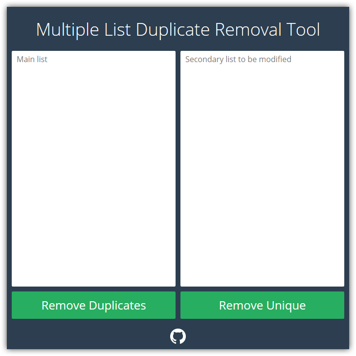

Multiple List Duplicate Removal Tool
==========================

Simple app written in JavaScript to remove duplicate lines on a second list from a first list. It's useful for removing dupliate addresses from two mailing lists.

[Visit the app](http://keavon.github.io/Multiple-List-Duplicate-Removal-Tool) and paste your primary list in the left column and your list with duplicates in the right column then hit *Remove Duplicates*.

For example, in the list below, the bolded entries will be removed when hitting *Remove Duplicates* because they also exist in the primary list.

Primary List | Secondary List
------------ | --------------
andy@example.com bill@example.com cindy@example.com dan@example.com eliza@example.com | **bill@example.com** **eliza@example.com** xavier@example.com yan@example.com zaroff@example.com

There is also a *Remove Unique* button that will remove all *except* the duplicates.

Pull requests are welcome.
