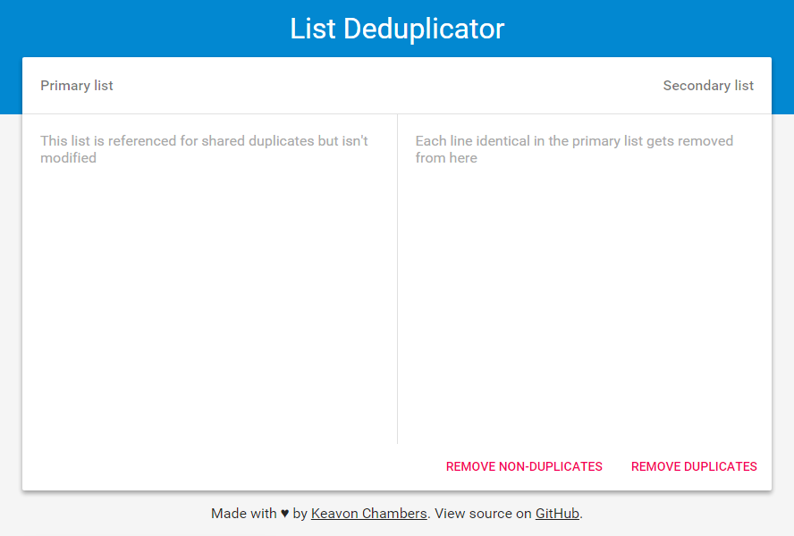

List Deduplicator
==========================

Simple web app written in JavaScript that removes duplicate lines from a secondary list that also exists in a primary list. For example, it's useful for removing duplicate addresses from two separate mailing lists.

[Visit the app](http://keavon.github.io/List-Deduplicator) and paste your primary list in the left column and your list with duplicates in the right column then hit *Remove Duplicates*.

For example, in the list below, the bolded entries will be removed when hitting *Remove Duplicates* because they also exist in the primary list.

Primary List | Secondary List
------------ | --------------
andy@example.com bill@example.com cindy@example.com dan@example.com emily@example.com | **bill@example.com** **emily@example.com** xavier@example.com yan@example.com zaroff@example.com

There is also a *Remove Unique* button that will remove all *except* the duplicates.

Pull requests are welcome.
